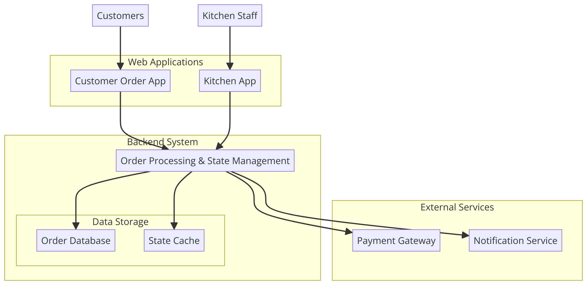

# Pizaa Ordering System
This is basic Pizza Ordring System with Nodejs(Express Framwork) with XState i.e. a state management and orchestration solution for JavaScript and TypeScript apps.

## implemented Order State Diagram

figure: Order State Diagram 
Here you can find the Implemented Order State Diagram https://stately.ai/registry/editor/de6e964e-60e7-4230-98db-d0df7f108288?machineId=0fe92ac4-18e2-4ab7-b3a4-af1b582000a9&mode=Simulate

## System Architecture Diagarm

## Getting Started

Built With
**Node.js - The runtime environment**
**Express - The web framework used**
**Sequelize - ORM for database management**

# Clone the Repository

bash
Copy code
`git clone git@github.com:khemrajregmi/POS-Pizza.git`

###Navigate to Project Directory

`cd POS-Pizza`
Install Dependencies

`npm install`

## Set Docker Environment
It will run the docker instance and automatically run the migration file 
`Docker composer up --build`

You should now have the application running on localhost:3001 (or whatever port you have configured).

Authors
Your Name - Khem

License
This project is licensed under the MIT License - see the LICENSE.md file for details.
